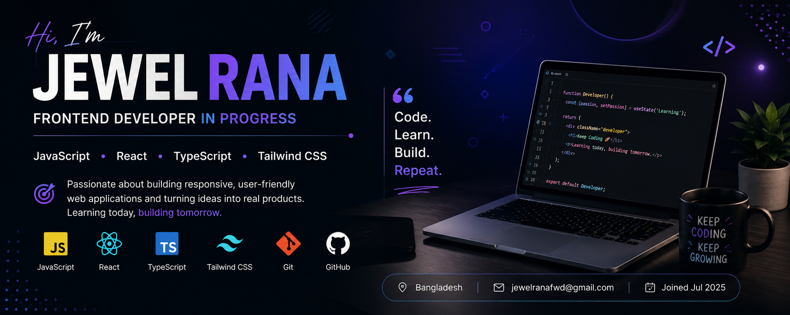

  

<h1 align="center">Hi 👋, I'm Jewel Rana</h1>

<h3 align="center">
  Frontend Developer in Progress | JavaScript • React • TypeScript
</h3>

  

---

## 👨‍💻 About Me

I'm **Jewel Rana**, a passionate web development learner who enjoys building modern and responsive websites.

- 🌱 Currently learning **JavaScript, React & TypeScript**
- 💻 Practicing **HTML, CSS & Tailwind CSS**
- 🚀 Building projects to improve my real-world development skills
- 🧠 Working on problem-solving and programming logic
- 🎯 My goal is to become a **Full-Stack Web Developer**
- ⚡ Fun fact: **I think I'm funny 😄**

---

## 🛠️ Tech Stack

### Frontend

  

  

  

  

  

  

### Tools

  

  

  

---

## 🌱 Currently Learning

**JavaScript** → **TypeScript** → **React** → **Tailwind CSS**

**Next Goal:** Node.js → Express.js → MongoDB → Full-Stack Development

---

## 🚀 Featured Projects

### ☕ Coffee Shop

A responsive coffee shop website created as part of my web development practice.

**Technologies:** HTML • CSS

🔗 [Live Demo](https://jewelranadev.github.io/Coffe-Shop/)

🔗 [Repository](https://github.com/jewelranadev/Coffe-Shop)

---

### 📚 B14-01 Assignment

A web development assignment project created during my learning journey.

**Technologies:** HTML • CSS

🔗 [Live Demo](https://jewelranadev.github.io/B14-01-Assignment/)

🔗 [Repository](https://github.com/jewelranadev/B14-01-Assignment)

---

## 🎯 2026 Goals

- [ ] Improve JavaScript fundamentals
- [ ] Master TypeScript
- [ ] Build advanced React applications
- [ ] Become comfortable with Tailwind CSS
- [ ] Learn Node.js & Express.js
- [ ] Learn MongoDB
- [ ] Build full-stack projects
- [ ] Build a professional portfolio
- [ ] Contribute to open-source projects

---

## 📊 GitHub Stats

  

  

---

## 🏆 GitHub Trophies

  

---

## 🤝 Connect With Me

  

  

  

📧 **Email:** jewelranafwd@gmail.com

---

  <b>💻 Learning today, building tomorrow.</b>

  ⭐ Thanks for visiting my profile!

