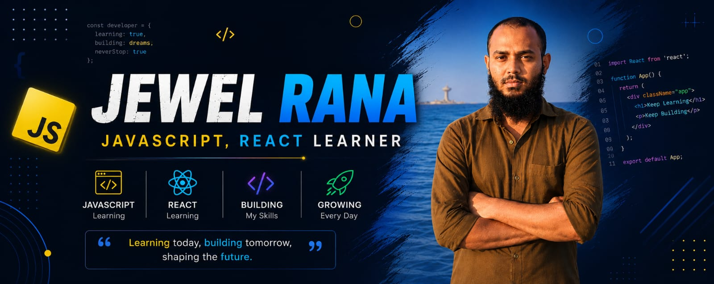

<p align="center">
  
</p>

<h1 align="center">Hi 👋, I'm Jewel Rana</h1>

<h3 align="center">
  Frontend Developer in Progress | JavaScript • React • Tailwind CSS
</h3>

<p align="center">
  <a href="https://github.com/jewelranadev">
    
  </a>
</p>

---

## 👨‍💻 About Me

I'm **Jewel Rana**, a passionate web development learner from Bangladesh.

* 🌱 Currently learning **JavaScript, React & Tailwind CSS**
* 💻 Building responsive and user-friendly web applications
* 🚀 Improving my problem-solving and programming skills
* 🎯 My goal is to become a **Full-Stack Web Developer**
* 📚 Always learning and exploring new technologies
* ⚡ Fun fact: **I think I'm funny 😄**

---

## 🛠️ Languages & Tools

<p align="left">
  <a href="https://www.w3.org/html/">
    
  </a>

  <a href="https://www.w3schools.com/css/">
    
  </a>

  <a href="https://developer.mozilla.org/en-US/docs/Web/JavaScript">
    
  </a>

  <a href="https://react.dev/">
    
  </a>

  <a href="https://tailwindcss.com/">
    
  </a>

  <a href="https://www.typescriptlang.org/">
    
  </a>

  <a href="https://git-scm.com/">
    
  </a>

  <a href="https://github.com/">
    
  </a>
</p>

---

## 🚀 My Projects

Here are some of the projects I'm currently working on and learning from:

### ☕ Coffee Shop

A responsive coffee shop website built while practicing HTML and CSS.

🔗 **Live Demo:**
https://jewelranadev.github.io/Coffee-Shop/

🔗 **Repository:**
https://github.com/jewelranadev/Coffe-Shop

---

## 📚 Currently Learning

```text
HTML & CSS
    ↓
JavaScript
    ↓
TypeScript
    ↓
React
    ↓
Tailwind CSS
    ↓
Node.js
    ↓
Express.js
    ↓
MongoDB
    ↓
Full-Stack Development
```

---

## 📊 GitHub Stats

<p align="center">
  
</p>

<p align="center">
  
</p>

---

## 🤝 Connect With Me

<p align="left">
  <a href="https://fb.com/ranafwd" target="_blank">
    
  </a>
</p>

📧 **Email:** [jewelranafwd@gmail.com](mailto:jewelranafwd@gmail.com)

---

<p align="center">
  ⭐ Thanks for visiting my profile!
</p>
